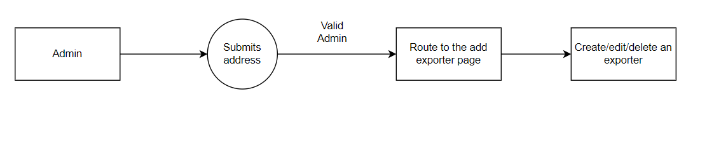

# Ethereum-Based Document Verification

## Introduction

The Document Registry project aims to reduce the forgery of academic documents by ensuring immutability and trust among the parties involved. It eliminates the need for third-party companies to conduct background screening of documents on behalf of other companies.

## Features

1. **Decentralized File Storage**

   - IPFS Integration: Files are stored on the InterPlanetary File System (IPFS), a decentralized network of nodes, instead of centralized servers.
   - Tamper-Resistant: Files stored on IPFS are immutable, preventing unauthorized modification or deletion.

2. **Immutable Data Records**

   - Blockchain Integration: Leverages the Ethereum blockchain to securely record and timestamp data transactions.
   - Immutable Records: Data transactions, such as document uploads or changes, are permanently recorded on the blockchain, providing a tamper-proof audit trail.

3. **Enhanced Data Security**

   - Smart Contracts: Implements Ethereum smart contracts for automated and secure execution of business logic, ensuring trustless interactions.

4. **Transparency and Auditability**

   - Transparent Transactions: Transactions on the Ethereum blockchain are transparent and publicly accessible, fostering trust and transparency.
   - Auditable History: Maintains a transparent and auditable history of data transactions, enabling stakeholders to verify the authenticity and integrity of data.

5. **Permissioned Access Control**

   - Role-Based Access: Implements role-based access control mechanisms using Ethereum smart contracts, allowing granular control over data access and operations.
   - Permission Management: Enables authorized users, such as exporters or administrators, to manage permissions and access rights.

6. **Distributed Network Resilience**
   - Fault Tolerance: IPFS utilizes a distributed network architecture, ensuring fault tolerance and high availability of data.

## Architecture

- Admin Workflow
  
- Exporter Workflow
  
- Verifier Workflow
  

## Routes

| Route            | Description                                 |
| ---------------- | ------------------------------------------- |
| `/`              | Home page of the project                    |
| `/admin`         | Admin authentication page                   |
| `/exporters`     | Add/edit an exporter                        |
| `/exporterslist` | List of all approved exporters              |
| `/upload`        | Fill in student information and upload file |
| `/documents`     | List of all documents issued by an exporter |
| `/verify`        | Upload a file and check its validity        |
| `/student`       | Enter student wallet address and view files |

## Technologies Used

- **Workflow Design**: Draw.io
- **Website**: NextJS, Semantic UI React (for CSS and styling)
- **Blockchain Network**: Ethereum
- **Smart Contracts**: Solidity programming language
- **Blockchain Wallet**: MetaMask
- **JavaScript Library**: Web3.js (for communicating with the blockchain)
- **IPFS Service**: Pinata
- **Testing Framework**: Mocha
- **Local Blockchain Network (for testing smart contract)**: ganache-cli
- **Solidity Compiler**: solc

## Getting Started

1. Clone this repository.
2. Install the required packages using `npm install`.
3. Compile the smart contract:
   - `cd ethereum`
   - `node compile.js`
4. Run `npm run dev` to start the development server.
5. Access the application at `http://localhost:3000`.
6. To run the tests on the smart contract, start the ganache CLI by typing `ganache-cli` in the terminal, then run `npm run test`.

## Authors

Developers

- [Mihir's LinkedIn Profile](https://www.linkedin.com/in/mihir-shah-322931231/)
